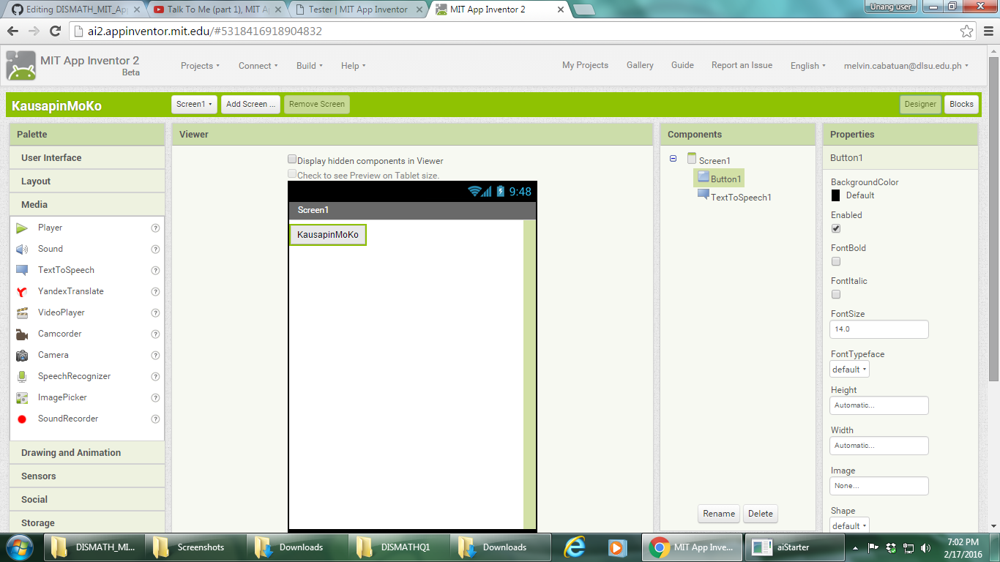

# DISMATH_MIT_App_Inventor

MIT App Inventor Introduction

## What is MIT App Inventor?

- MIT App Inventor: Mobile Apps. Built by You. (https://www.youtube.com/watch?v=sNjGAiOrX-o) 
- FYI: (http://appinventor.mit.edu/explore/)
- Tutorials: (http://appinventor.mit.edu/explore/ai2/tutorials?)

## Get started

- Install  App Inventor for Windows (http://appinventor.mit.edu/explore/ai2/windows.html)
- Follow 'Installing the App Inventor Setup software package' instructions. (http://appinventor.mit.edu/explore/ai2/windows.html)
- Click through the steps of the installer. Do not change the installation location but record the installation directory, because you might need it to check the driver. The directory will differ depending on your version of Windows and whether or not you are logged in as an administrator.

## Starting App Inventor for the First Time

- Before you begin, make sure you have access to the following things: (1) Internet; and (2) A Gmail account (this is how you will log in to App Inventor) | Use DLSU gmail account.
- Start the Designer and create a new project. Follow the instructions here: (http://appinventor.mit.edu/explore/start-first-time.html)

- Add button

- Change button text

## Connect phone

- Connecting to a phone or tablet with a USB cable (http://appinventor.mit.edu/explore/ai2/setup-device-usb.html#step2)
- Connection test: (http://appinventor.mit.edu/test/)

## Tutorial

- Talk To Me (part 1), MIT App Inventor Tutorial #1 (https://www.youtube.com/watch?v=Vdo8UdkgDD8)
